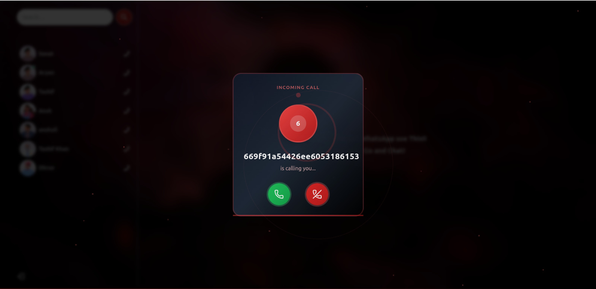

🎙️ GupShup - Real-Time Chat & Voice Call Web App

GupShup is a modern full-stack web application that allows users to chat and initiate real-time voice calls over the internet — built using React, Zustand, WebRTC, and Socket.IO.
🚀 Features

    💬 Real-Time Text Chat between users

    📞 Voice Calling using peer-to-peer WebRTC

    🔔 Incoming Call Alerts with accept/reject functionality

    🟢 Online/Offline Status indicators

    🔍 Search Contacts by name

    📱 Responsive UI built with TailwindCSS

    ⚡ State Management via Zustand

    🧠 Smart Session Handling using sessionStorage

🛠️ Tech Stack
Frontend	Real-Time / Media	State & Backend
React	Socket.IO (WebSocket)	Zustand (state mgmt)
Tailwind CSS	WebRTC + Simple-Peer	Appwrite (or Express)
React Router		
## 🖼️ Screenshots

### 💬 Home Page

### 🔔 Call Notification Modal

### 📞 Calling Page

---
	
	
📂 Project Structure (Frontend)

src/
├── components/
│   ├── Calls/
│   ├── messages/
│   ├── Sidebar/
│   └── ...
├── Context/
│   └── SocketContext.js
├── Hooks/
├── Zustand/
├── pages/
│   ├── Home.jsx
│   └── CallPage.jsx
├── App.jsx
└── main.jsx

🔧 Getting Started
1. Clone the Repo

git clone https://github.com/your-username/gupshup.git
cd gupshup

2. Install Dependencies

npm install

3. Environment Setup

Create a .env file in the root directory and configure your Appwrite or backend service (if used):

VITE_APPWRITE_URL=https://cloud.appwrite.io/v1
VITE_APPWRITE_PROJECT_ID=your_project_id
VITE_APPWRITE_DATABASE_ID=your_database_id
...

4. Start the App

npm run dev

🧪 How It Works

    On login, the user is connected to the Socket.IO server.

    Real-time chat is updated live via WebSockets.

    Voice calls are initiated using simple-peer, exchanging WebRTC offers/answers through Socket.IO.

    Audio is transmitted peer-to-peer between the caller and receiver.

Built with ❤️ by Adarsh Sharma
📃 License

MIT License. Feel free to use, fork, and improve GupShup! 🤝